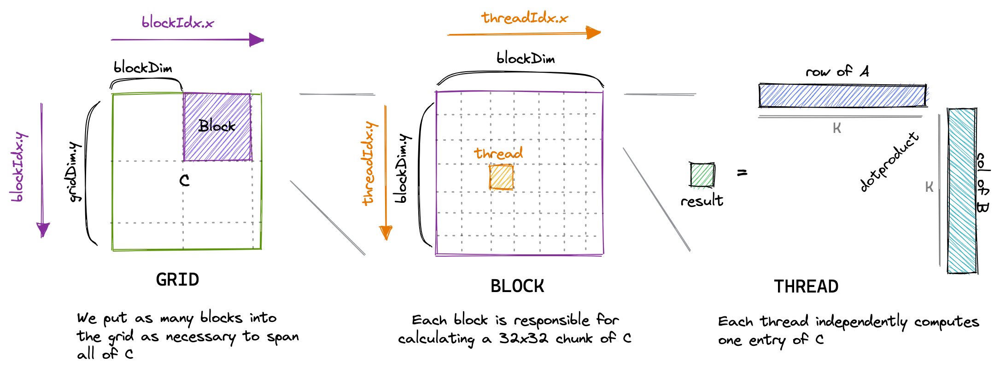

## GPU-Accelerated Neural Network Library
A library for creating GPU-accelerated neural networks in CUDA C. 

This project is a personal endeavor to further explore parallel programming with thread parallelism and synchronization on the GPU. Built upon my capstone project in the _Operating Systems and Parallel Algorithms_ class at Grinnell College.

## Installation and Setup Instructions

WIP!

## Rationale for Matrix Multiplication Optimization Techniques

Since matrix multiplications are parallelized across threads, the runtime of the actual individual calculations are optimized. Therefore, the main bottleneck that SGEMMs suffer from is memory access, including reading from the matrices to be multiplied and writing to the resulting matrix.

In a naive memory access schema, each cell in the resulting matrix (called matrix C, as opposed to the input matrices A and B) is handled by one thread on the GPU. Each thread computes the dot product of the ith in matrix A and the ith column in matrix B.

### Global Memory Coalescing

The naive schema fails to take advantage of the way memory is stored and laid out for each matrix. The consequence is an unnecessarily large number of "transactions" between the program and the virtual memory for matrix cells, which can in fact be grouped into one transaction. 

"Global memory coalescing" refers to an application of this concept, where sequential memory accesses by threads of the same warp (a collection of threads whose instructions are executed on the same physical GPU core) can be grouped and executed at the same time.

This graphic succinctly demonstrates memory coalescing. The short version is that we want to put threads that can access consecutive values in memory in the same warp. By achieving this, we significantly reduce the number of transactions required to access memory.

### Shared Memory Cache-Blocking

In addition to the global memory, each thread block also has a level of shared memory that all threads within that block can access. Since this memory is located closer than global memory, it has lower latency; therefore, we make use of this memory as a form of cache to avoid going out to global memory too frequently.

## Reflection
This project started as a 4-week capstone project for the class _CSC213: Operating Systems and Parallel Algorithms_ at Grinnell College. The project serves as a culminating demonstration of my understanding and profiency with GPU Parallelism, as well as a proof of concept for an exciting and crucial application of general-purpose GPU programming -- accelerating neural networks.

The main challenges that arose throughout the project concerned mainly two specific endeavors: 

- Translating the math for various activation and loss functions into code, and implementing chained derivatives of those functions
- Maintaining a customizable neural network creation process that allows users to compose multiple hidden layers with different dimensions and activation/loss functions.

While some of these obstacles remain due to time constraints, getting a hands-on taste of them has allowed me to comprehend the engineering effort behind full-fledged, well-supported libraries such as PyTorch and Tensorflow.

## Acknowledgements
The memory access optimization techniques are largely taken from this incredibly informative and detailed blog by Simon Boehm, titled [_How to Optimize a CUDA Matmul Kernel for cuBLAS-like Performance: a Worklog_](https://siboehm.com/articles/22/CUDA-MMM). The figures above were also acquired from his blog.
